# Logbook 10

## Task 1 -- Posting a Malicious Message to Display an Alert Window

For this first task we had to display a message on one chosen profile. We decided to do so in Samy's profile, and typed the following code on it's brief biography:
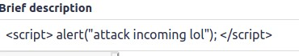

With this input, we obtained the following result to anyone entering Samy's profile:
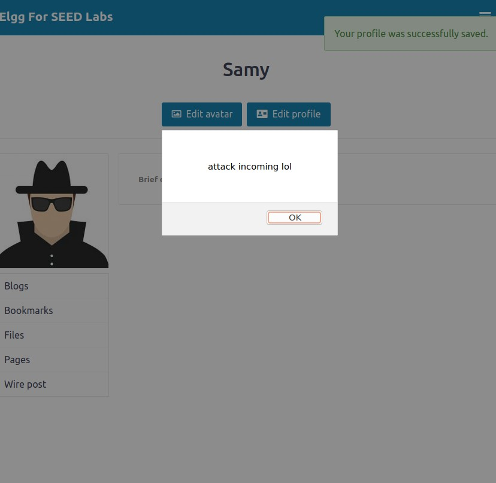


## Task 2 -- Posting a Malicious Message to Display Cookies

For this task we gave as input the line of code present in the script and got the following result:
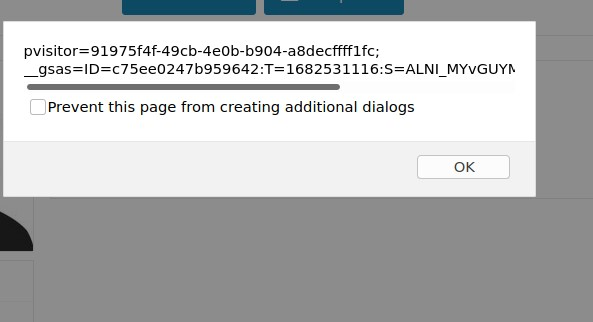


## Task 3 -- Stealing Cookies from the Victim’s Machine

After providing the following code:
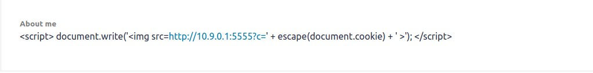

We were capable of obtaining the cookies of the user Samy, as shown under:
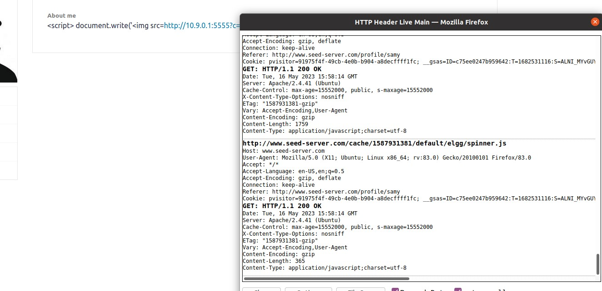


## Task 4 -- Becoming the Victim’s Friend

After discovering the code to add the victim as friend (59), by logging in its profile and sending Samy a friend request, we gave the following input to Samy about me page.
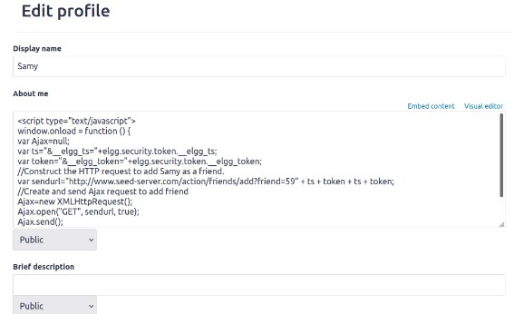

With this, we logged out of Samy's account into Alice's and checked if Samy was her friend.
We obtained the following output:
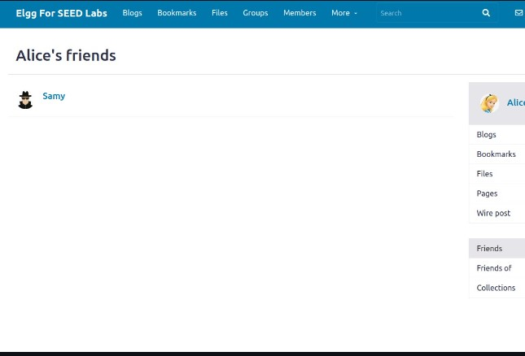

Question 1:
We need lines ➀ and ➁ to make sure our attack works. Without the secret token and timestamp value of the website, it won't be seen as legitimate, and an error will occur. So, if we don't include those lines, our will fail.

Question 2:
We don't think so, but we don't know the answer.


# CFT 10


## Challenge 1

---

After opening the website we see a form with a text input.

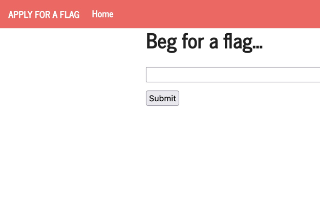

The strategy to solve this CTF was using XSS attack.

This can be achieved by sending the following line through the text input:
```html
<script> document.getElementById('giveflag').click() </script>
```


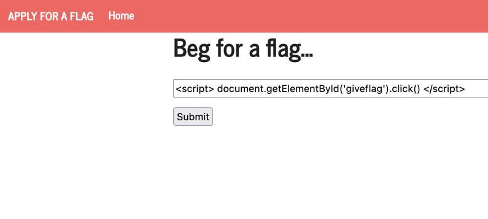

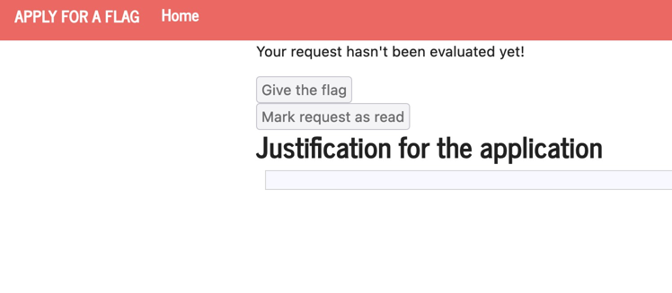


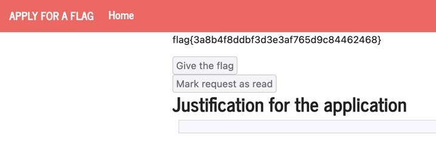

And here's the flag:
### flag{3a8b4f8ddbf3d3e3af765d9c84462468}


## Challenge 2

---

When we get on the website we are greeted with this menu:

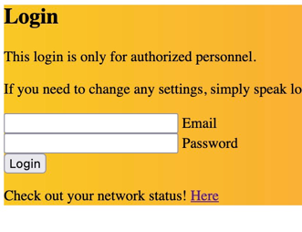

After pressing 'Here' we go to this page:

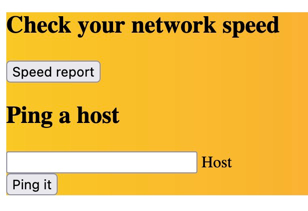


After searching and exploring for a while we discover we can use commands in the input 'Ping a host' bar.

We discover that just like a normal terminal we can navigate through the files with the comand `cd`.

After searching this newly found "terminal" we discover that with this chain of commands the flags are printed:

``
cd .. ; cd .. ;cd .. ;cd .. ;cd .. ; cd flags; cat flag.txt
``

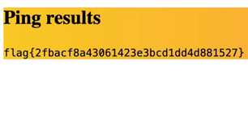

### flag{d5ead24415078c71280c605057719be2} 
