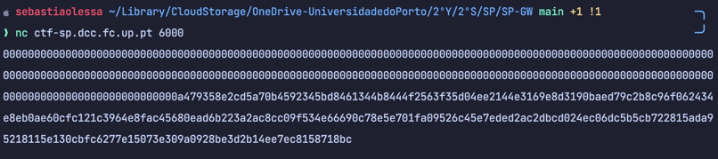
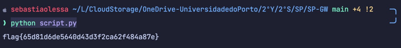
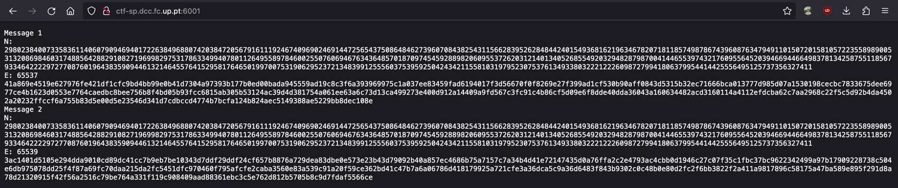
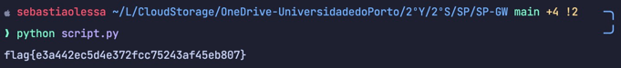

# LOGBOOK 12

# CTFs

## Challenge 1

When we connect to the server we see this:

To decipher this we used the following script:

script.py

    from binascii import hexlify, unhexlify
    from sympy import *
    
    p = nextprime(2 ** 512)  # next prime 2**512
    q = nextprime(2 ** 513)  # next prime 2**513
    n = p * q
    e = 0x10001  # a constant -> expoente público
    d = pow(e, -1, ((p - 1) * (q - 1)))  # a number such that d*e % ((p-1)*(q-1)) = 1 -> expoente privado
    
    enc_flag = b"0000000000000000000000000000000000000000000000000000000000000000000000000000000000000000000000000000000000" \
    b"0000000000000000000000000000000000000000000000000000000000000000000000000000000000000000000000000000000000" \
    b"00000000000000000000000000000000000000000000a479358e2cd5a70b4592345bd8461344b8444f2563f35d04ee2144e3169e8d" \
    b"3190baed79c2b8c96f062434e8eb0ae60cfc121c3964e8fac45680ead6b223a2ac8cc09f534e66690c78e5e701fa09526c45e7eded" \
    b"2ac2dbcd024ec06dc5b5cb722815ada95218115e130cbfc6277e15073e309a0928be3d2b14ee7ec8158718bc"
    
    def enc(x):
        int_x = int.from_bytes(x, "big")
        y = pow(int_x, e, n)
        return hexlify(y.to_bytes(256, 'big'))
    
    def dec(y):
        int_y = int.from_bytes(unhexlify(y), "big")
        x = pow(int_y, d, n)
        return x.to_bytes(256, 'big')

    y = dec(enc_flag)
    print(y.decode())

First, we used the 'nextprime' function in Python to find the secret prime numbers p and q.
Then, knowing the public exponent e (0x10001) and using the values of p and q, the private exponent d was calculated using the formula d = (1/e) mod ((p-1)*(q-1)).
The variable 'enc_flag' contains the message we want to decrypt, which in this case is the flag sent by the server.
When we run the program, the decrypted flag is displayed:

### flag{65d81d6de5640d43d3f2ca62f484a87e}

## Challenge 2

In this challenge, the server sends two RSA-encrypted messages that contain the same flag. Both messages have the same modulus (n) but different public exponents.

To recover the flag, we used the following script:

script.py

    from binascii import hexlify, unhexlify
    
    c_s = int.from_bytes(unhexlify(b"41a869e4519e627976fe421df1cfc9bd4bb99e0b41d7304a97393b177b0ed00bada945559ad19c8c3f6a393969975c1a037ee83459fad6194017f3d56670f0f8269e27f399ad1cf530b90aff0843d5315b32ec71666bca013777d985d07a1530198cecbc7833675dee6977ce4b1623d0553e7764caedbc8bee756b8f4bd05b93fcc6815ab305b53124ac39d4d381754a061ee63a6c73d13ca499273e400d912a14409a9fd567c3fc91c4b86cf5d09e6f8dde40dda36043a160634482acd3160114a4112efdcba62c7aa2968c22f5c5d92b4da4502a20232ffccf6a755b83d5e00d5e23546d341d7cdbccd4774b7bcfa124b824aec5149388ae5229bb8dec108e"),"big")
    c_j = int.from_bytes(unhexlify(b"3ac1401d5105e294dda9010cd89dc41cc7b9eb7be10343d7ddf29ddf24cf657b8876a729dea83dbe0e573e23b43d79092b40a857ec4686b75a7157c7a34b4d41e72147435d0a76ffa2c2e4793ac4cbb0d1946c27c07f35c1fbc37bc9622342499a97b17909228738c504e6db975078dd25f4f87a69fc70daa215da2fc5451dfc970460f795afcfe2caba3560e83a539c91a20f59ce362bd41c47b7a6a06786d418179925a721cfe3a36dca5c9a36d6483f843b9302c0c48b0e80d2fc2f6bb3822f2a411a9817896c58175a47ba589e895f291d8a78d21320915f42f56a2516c79be764a331f119c908409aad88361ebc3c5e762d812b5705b8c9d7fdaf5566ce"),"big")
    e_s = 0x10001
    e_j = 0x10003
    n = 29802384007335836114060790946940172263849688074203847205679161119246740969024691447256543750864846273960708438254311566283952628484424015493681621963467820718118574987867439608763479491101507201581057223558989005313208698460317488564288291082719699829753178633499407801126495589784600255076069467634364857018709745459288982060955372620312140134052685549203294828798700414465539743217609556452039466944664983781342587551185679334642222972770876019643835909446132146455764152958176465019970075319062952372134839912555603753959250424342115581031979523075376134933803222122260987279941806379954414425556495125737356327411
    
    def extended_euclidean(a, b):
        if b == 0:
            return (a, 1, 0)
        gcd, x, y = extended_euclidean(b, a % b)
        return (gcd, y, x - (a // b) * y)
    
    (gcd,a,b) = extended_euclidean(e_s, e_j)
    
    i = pow(c_j, -1, n)
    
    m = (pow(c_s,a,n)*pow(i,-b,n)) % n
    
    m = m.to_bytes(256,'big')
    
    print(m.decode())

c_s and c_j contain the messages sent by the server, and e_s and e_j are the public keys of c_s and c_j, respectively.

If gcd(e_s, e_j) = 1, then there exist integers a and b: e_s * a + e_j * b = 1.
Using an extension of the Euclidean algorithm, we calculated the coefficients a and b (a = 32769 and b = -32768).
Since b is negative, the equation m = (c_s^a * c_j^b) mod n would cause issues.
Therefore, we calculated the modular inverse of c_j (i = c_j^(-1) mod n), and finally obtained the message with m = (c_s^a * i^(-b)) mod n.

### flag{e3a442ec5d4e372fcc75243af45eb807}
